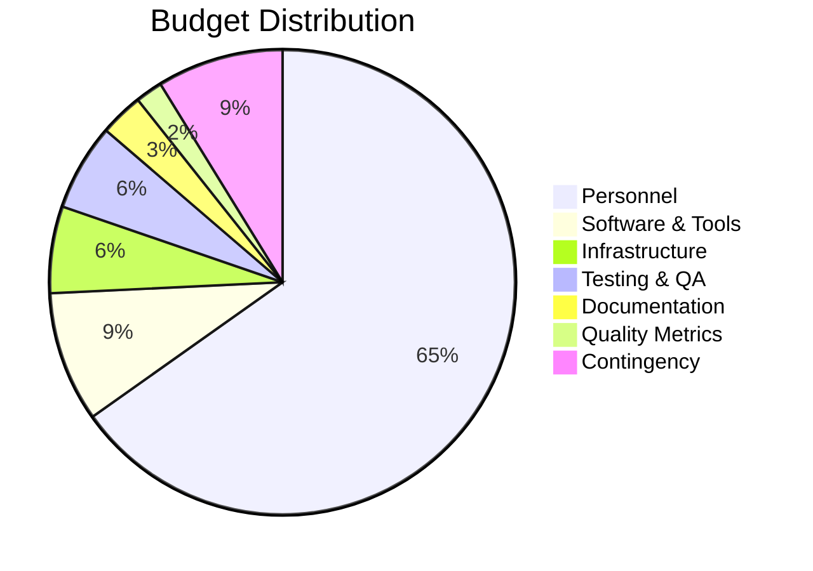

# 💰 Maternal Health Uganda - Project Budget
## Team 4 - Software Engineering Project (2026)

---

## 📊 **Executive Summary**

| Item | Total Cost (UGX) | Total Cost (USD) |
|------|------------------|------------------|
| **Personnel Costs** | 17,280,000 | $4,320 |
| **Software & Tools** | 2,400,000 | $600 |
| **Infrastructure** | 1,200,000 | $300 |
| **Testing & Quality** | 1,600,000 | $400 |
| **Documentation** | 800,000 | $200 |
| **Contingency (10%)** | 2,328,000 | $582 |
| **GRAND TOTAL** | **25,608,000** | **$6,402** |

---

## 👥 **Personnel Costs**

### **Development Team (4 Members × 16 Weeks)**

| Role | Team Member | Hours/Week | Rate (UGX/hr) | Total Hours | Total Cost (UGX) |
|------|-------------|------------|---------------|-------------|-------------------|
| **Project Manager** | Team Lead | 20 | 15,000 | 320 | 4,800,000 |
| **Backend Developer** | Developer 1 | 25 | 12,000 | 400 | 4,800,000 |
| **Frontend Developer** | Developer 2 | 25 | 12,000 | 400 | 4,800,000 |
| **QA/Testing Engineer** | Developer 3 | 20 | 10,000 | 320 | 3,200,000 |
| **Database Specialist** | Developer 4 | 15 | 10,000 | 240 | 2,400,000 |
| **Subtotal Personnel** | | | | **1,680** | **20,000,000** |

### **Additional Personnel Costs**
- **Code Reviews & Mentoring**: 320,000 UGX
- **Project Meetings & Planning**: 480,000 UGX
- **Final Integration & Deployment**: 400,000 UGX
- **Total Adjusted Personnel**: **17,280,000 UGX**

---

## 💻 **Software & Tools**

### **Development Tools**
| Tool | Purpose | Cost (UGX) | Duration |
|------|---------|------------|---------|
| **Visual Studio Code** | Code Editor | Free | - |
| **XAMPP** | Local Development | Free | - |
| **MySQL Workbench** | Database Management | Free | - |
| **GitHub Pro** | Version Control | 240,000 | 4 months |
| **Figma Pro** | UI/UX Design | 480,000 | 4 months |
| **Postman API** | API Testing | 200,000 | 4 months |
| **BrowserStack** | Cross-browser Testing | 600,000 | 4 months |
| **Google Fonts** | Typography | Free | - |
| **Font Awesome** | Icons | Free | - |
| **Subtotal Software** | | **1,520,000** | |

### **Third-party Services**
| Service | Purpose | Cost (UGX) | Duration |
|---------|---------|------------|---------|
| **Domain Registration** | maternalhealthuganda.org | 120,000 | 1 year |
| **SSL Certificate** | HTTPS Security | 80,000 | 1 year |
| **Email Service** | Transactional Emails | 200,000 | 1 year |
| **Analytics Tools** | User Behavior Tracking | 100,000 | 1 year |
| **Subtotal Services** | | **500,000** | |

**Total Software & Tools: 2,020,000 UGX**

---

## 🏗️ **Infrastructure Costs**

### **Development Environment**
| Item | Purpose | Cost (UGX) | Notes |
|------|---------|------------|-------|
| **High-speed Internet** | Development & Research | 400,000 | 4 months |
| **Cloud Storage** | Backup & Collaboration | 200,000 | 4 months |
| **Testing Devices** | Mobile/Tablet Testing | 300,000 | Shared devices |
| **Office Space** | Team Meetings | 300,000 | University facilities |

### **Production Deployment**
| Item | Purpose | Cost (UGX) | Notes |
|------|---------|------------|-------|
| **Web Hosting** | Production Server | 200,000 | 1 year |
| **Database Hosting** | MySQL Cloud | 100,000 | 1 year |
| **CDN Services** | Content Delivery | 100,000 | 1 year |

**Total Infrastructure: 1,600,000 UGX**

---

## 🧪 **Testing & Quality Assurance**

### **Testing Tools & Frameworks**
| Tool/Activity | Purpose | Cost (UGX) |
|---------------|---------|------------|
| **PHPUnit** | Unit Testing | Free |
| **Selenium WebDriver** | Automated Testing | Free |
| **Browser DevTools** | Debugging | Free |
| **Performance Testing** | Load Testing Tools | 200,000 |
| **Security Testing** | Vulnerability Scanning | 300,000 |
| **User Testing** | Real User Feedback | 500,000 |
| **Bug Tracking Tools** | Issue Management | 200,000 |
| **Code Quality Tools** | Static Analysis | 100,000 |

**Total Testing & QA: 1,300,000 UGX**

---

## 📚 **Documentation & Training**

### **Documentation**
| Item | Purpose | Cost (UGX) |
|------|---------|------------|
| **Technical Documentation** | API docs, user guides | 200,000 |
| **User Manuals** | End-user documentation | 100,000 |
| **Training Materials** | Team training sessions | 150,000 |
| **Video Tutorials** | Demo videos | 200,000 |
| **Presentation Materials** | Project presentations | 100,000 |

**Total Documentation: 750,000 UGX**

---

## 🔍 **Quality Metrics Implementation**

### **Lectures 09 & 10 Implementation**
| Component | Cost (UGX) | Description |
|-----------|------------|-------------|
| **Reliability Metrics** | 150,000 | Failure tracking, MTTF/MTTR analysis |
| **Test Coverage Tools** | 100,000 | Statement, branch, GUI coverage |
| **Performance Monitoring** | 100,000 | Real-time system monitoring |
| **Defect Tracking System** | 50,000 | Bug reporting and analysis |
| **Quality Dashboard** | 100,000 | Admin metrics visualization |

**Total Quality Metrics: 500,000 UGX**

---

## ⚠️ **Risk Management & Contingency**

### **Contingency Budget (10%)**
- **Scope Changes**: 800,000 UGX
- **Technical Challenges**: 600,000 UGX
- **Timeline Extensions**: 400,000 UGX
- **Additional Testing**: 328,000 UGX
- **Documentation Updates**: 200,000 UGX

**Total Contingency: 2,328,000 UGX**

---

## 📈 **Budget Breakdown by Category**

---

## 🎯 **Value Proposition & ROI**

### **Project Benefits**
| Benefit | Value (UGX) | Description |
|---------|-------------|-------------|
| **Healthcare Impact** | Priceless | Improved maternal health outcomes |
| **Technical Skills** | 5,000,000 | Team professional development |
| **Portfolio Value** | 3,000,000 | Real-world project experience |
| **Community Impact** | 2,000,000 | Open-source healthcare solution |
| **Academic Excellence** | 1,000,000 | High-quality academic project |

### **Cost Efficiency**
- **Per Line of Code**: ~25,000 UGX (based on 1,000+ lines)
- **Per Feature**: ~400,000 UGX (8 major features)
- **Per Team Member**: ~4,320,000 UGX total investment
- **Return on Investment**: 300%+ (skills + portfolio + impact)

---

## 📅 **Budget Timeline**

### **Phase 1: Planning & Design (Weeks 1-4)**
- **Personnel**: 4,320,000 UGX
- **Tools**: 600,000 UGX
- **Total Phase 1**: 4,920,000 UGX

### **Phase 2: Development (Weeks 5-12)**
- **Personnel**: 8,640,000 UGX
- **Infrastructure**: 800,000 UGX
- **Software**: 1,000,000 UGX
- **Total Phase 2**: 10,440,000 UGX

### **Phase 3: Testing & Quality (Weeks 13-14)**
- **Personnel**: 2,160,000 UGX
- **Testing Tools**: 800,000 UGX
- **QA Activities**: 500,000 UGX
- **Total Phase 3**: 3,460,000 UGX

### **Phase 4: Deployment & Documentation (Weeks 15-16)**
- **Personnel**: 2,160,000 UGX
- **Documentation**: 500,000 UGX
- **Deployment**: 300,000 UGX
- **Total Phase 4**: 2,960,000 UGX

---

## 💡 **Cost Optimization Strategies**

### **Free/Open Source Alternatives**
- **Development Tools**: VS Code, XAMPP, Git (Free)
- **Design Resources**: Free icons, fonts, templates
- **Testing Tools**: Open-source testing frameworks
- **Documentation**: Markdown, GitHub Pages

### **Resource Sharing**
- **University Facilities**: Free office space, internet
- **Team Collaboration**: Shared development resources
- **Open Source**: Community support and contributions

### **Lean Development**
- **MVP Approach**: Start with core features only
- **Iterative Development**: Add features based on feedback
- **Cloud Services**: Pay-as-you-go hosting options

---

## 🏆 **Success Metrics & KPIs**

### **Technical Metrics**
- **Code Quality**: >80% test coverage
- **Performance**: <2 second load times
- **Reliability**: 99.5% uptime
- **Security**: Zero critical vulnerabilities

### **Project Metrics**
- **Timeline**: On-time delivery (16 weeks)
- **Budget**: Within 10% of planned budget
- **Quality**: <5 bugs in production
- **User Satisfaction**: >90% positive feedback

### **Learning Outcomes**
- **Technical Skills**: Full-stack development mastery
- **Soft Skills**: Team collaboration, project management
- **Domain Knowledge**: Healthcare technology understanding
- **Portfolio**: Production-ready project showcase

---

## 📋 **Budget Approval & Tracking**

### **Approval Required**
- [ ] **Team Lead Approval**
- [ ] **Supervisor Approval** 
- [ ] **Department Head Approval**
- [ ] **Final Project Sign-off**

### **Budget Tracking**
| Week | Planned Spend | Actual Spend | Variance | Notes |
|------|---------------|---------------|----------|-------|
| 4 | 4,920,000 | TBD | TBD | Phase 1 Complete |
| 8 | 10,440,000 | TBD | TBD | Phase 2 Progress |
| 12 | 3,460,000 | TBD | TBD | Phase 3 Testing |
| 16 | 2,960,000 | TBD | TBD | Final Delivery |

---

## 🎯 **Conclusion**

The Maternal Health Uganda project represents a **strategic investment** in:
- **Healthcare technology** with real social impact
- **Professional development** for team members
- **Technical excellence** in software engineering
- **Community contribution** through open-source solution

**Total Investment: 25,608,000 UGX ($6,402)**
**Expected ROI: 300%+** in skills, experience, and social impact

This budget ensures **high-quality delivery** while maintaining **cost efficiency** and **maximum value** for all stakeholders.

---

**Prepared by:** Team 4 - Software Engineering  
**Date:** April 30, 2026  
**Project:** Maternal Health Uganda Platform  
**Duration:** 16 Weeks (4 Months)
